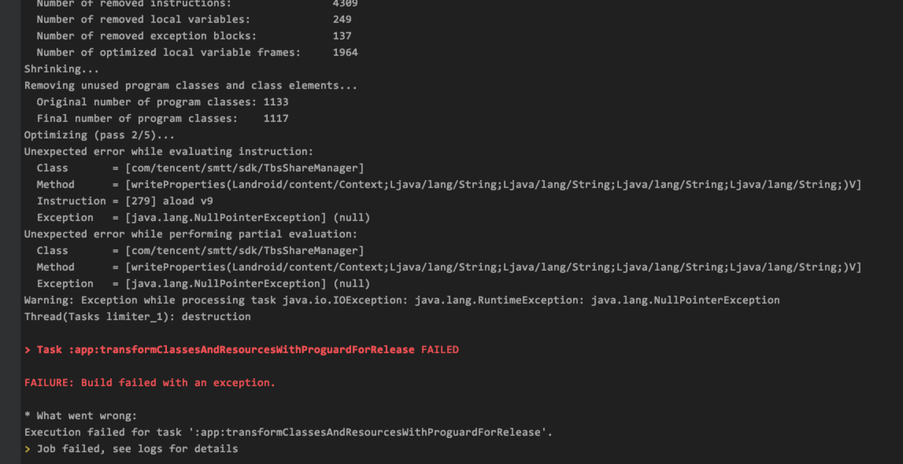

# 接入Tencent TBS过程中遇到的混淆问题

最近需要接入腾讯的X5浏览器，SDK正常接入验证功能后，准备处理release包的混淆问题。

官方提供的demo中是开启-dontoptimize，关闭shrinkResources的，也就是不进行优化，而项目中需要进行优化，这样在项目中编译时会报错



优化过程中出现了类找不到的情况，应该是被混淆过了找不到。参考[官方文档](https://www.guardsquare.com/en/products/proguard/manual/usage/optimizations)，可以通过-optimizations optimization_filter来控制哪些不要被混淆。

不过具体也不好找得到哪个能对应这步优化，只好通过二分法来处理了。

```
-optimizations !method/propagation/*, !class/unboxing/enum
```

这样编译通过。