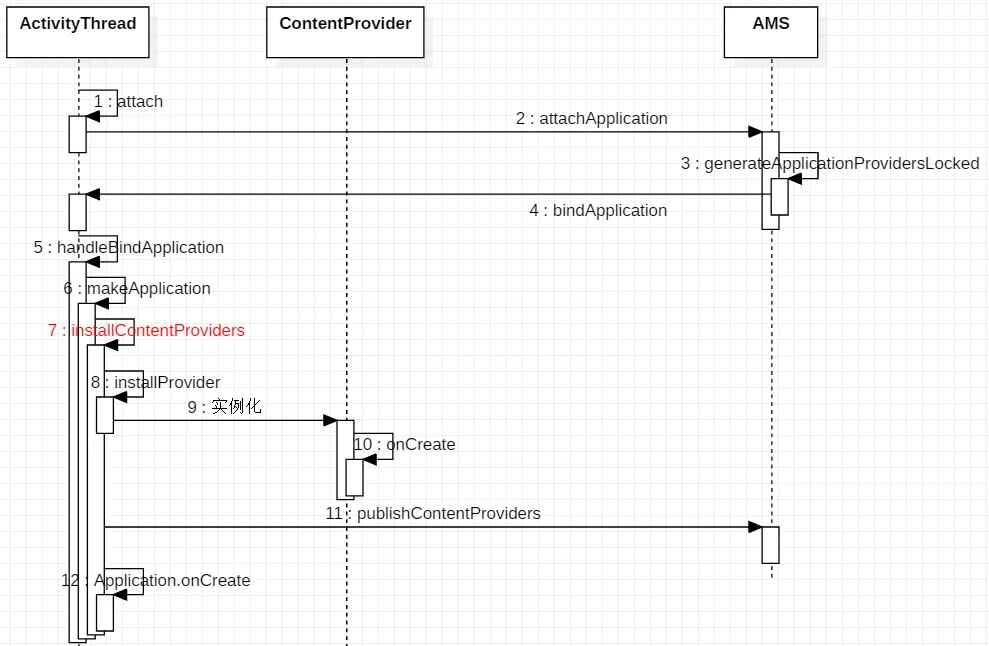
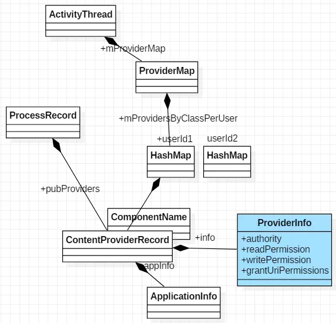

# ContentProvider

Provider是Android四大组件之一，可以用来进行数据共享。

## 统一资源标识符URI

作用：外界进程通过 URI 找到对应的ContentProvider & 其中的数据，再进行数据操作。

URI分为 系统预置 & 自定义，分别对应系统内置的数据（如通讯录、日程表等等）和自定义数据库
1. 关于 系统预置URI 此处不作过多讲解，需要的同学可自行查看
2. 此处主要讲解 自定义URI

## MIME数据类型

作用：指定某个扩展名的文件用某种应用程序来打开
如指定 .html 文件采用 text 应用程序打开、指定 .pdf 文件采用 flash 应用程序打开

每种MIME类型 由2部分组成 = 类型 + 子类型

```
text / html
text/css
text/xml
application/pdf
```

## Provider使用

ContentProvider主要以 表格的形式 组织数据

同时也支持文件数据，只是表格形式用得比较多

每个表格中包含多张表，每张表包含行 & 列，分别对应记录 & 字段
同数据库

### 主要方法

```
<-- 4个核心方法 -->
  public Uri insert(Uri uri, ContentValues values)
  // 外部进程向 ContentProvider 中添加数据

  public int delete(Uri uri, String selection, String[] selectionArgs)
  // 外部进程 删除 ContentProvider 中的数据

  public int update(Uri uri, ContentValues values, String selection, String[] selectionArgs)
  // 外部进程更新 ContentProvider 中的数据

  public Cursor query(Uri uri, String[] projection, String selection, String[] selectionArgs,  String sortOrder)　
  // 外部应用 获取 ContentProvider 中的数据

  // 注：
  // 1. 上述4个方法由外部进程回调，并运行在ContentProvider进程的Binder线程池中（不是主线程）
  // 2. 存在多线程并发访问，需要实现线程同步
  //  a. 若ContentProvider的数据存储方式是使用SQLite & 一个，则不需要，因为SQLite内部实现好了线程同步，若是多个SQLite则需要，因为SQL对象之间无法进行线程同步
  //  b. 若ContentProvider的数据存储方式是内存，则需要自己实现线程同步

<-- 2个其他方法 -->
public boolean onCreate()
// ContentProvider创建后 或 打开系统后其它进程第一次访问该ContentProvider时 由系统进行调用
// 注：运行在ContentProvider进程的主线程，故不能做耗时操作

public String getType(Uri uri)
// 得到数据类型，即返回当前 Url 所代表数据的MIME类型
```

## ContentResolver类

作用：统一管理不同 ContentProvider间的操作，即通过 URI 即可操作 不同的ContentProvider 中的数据，外部进程通过 ContentResolver类 从而与ContentProvider类进行交互


为什么要使用通过ContentResolver类从而与ContentProvider类进行交互，而不直接访问ContentProvider类？

一般来说，一款应用要使用多个ContentProvider，若需要了解每个ContentProvider的不同实现从而再完成数据交互，操作成本高 & 难度大

所以再ContentProvider类上加多了一个 ContentResolver类对所有的ContentProvider进行统一管理。

```
// 使用ContentResolver前，需要先获取ContentResolver
// 可通过在所有继承Context的类中 通过调用getContentResolver()来获得ContentResolver
ContentResolver resolver =  getContentResolver();

// 设置ContentProvider的URI
Uri uri = Uri.parse("content://cn.scu.myprovider/user");

// 根据URI 操作 ContentProvider中的数据
// 此处是获取ContentProvider中 user表的所有记录
Cursor cursor = resolver.query(uri, null, null, null, "userid desc");
```


## Android 提供了3个用于辅助ContentProvide的工具类：

- ContentUris
- UriMatcher
- ContentObserver


### ContentUris类

作用：操作 URI

#### 具体使用
核心方法有两个：withAppendedId（） &parseId（）

```
// withAppendedId（）作用：向URI追加一个id
Uri uri = Uri.parse("content://cn.scu.myprovider/user")
Uri resultUri = ContentUris.withAppendedId(uri, 7);  
// 最终生成后的Uri为：content://cn.scu.myprovider/user/7

// parseId（）作用：从URL中获取ID
Uri uri = Uri.parse("content://cn.scu.myprovider/user/7")
long personid = ContentUris.parseId(uri);
//获取的结果为:7
```


### UriMatcher类

作用：在ContentProvider 中注册URI，根据 URI 匹配 ContentProvider 中对应的数据表


#### 具体使用

```
    // 步骤1：初始化UriMatcher对象
    UriMatcher matcher = new UriMatcher(UriMatcher.NO_MATCH);
    //常量UriMatcher.NO_MATCH  = 不匹配任何路径的返回码
    // 即初始化时不匹配任何东西

    // 步骤2：在ContentProvider 中注册URI（addURI（））
    int URI_CODE_a = 1；
    int URI_CODE_b = 2；
    matcher.addURI("cn.scu.myprovider", "user1", URI_CODE_a);
    matcher.addURI("cn.scu.myprovider", "user2", URI_CODE_b);
    // 若URI资源路径 = content://cn.scu.myprovider/user1 ，则返回注册码URI_CODE_a
    // 若URI资源路径 = content://cn.scu.myprovider/user2 ，则返回注册码URI_CODE_b

    // 步骤3：根据URI 匹配 URI_CODE，从而匹配ContentProvider中相应的资源（match（））

    @Override   
    public String getType(Uri uri) {   
      Uri uri = Uri.parse(" content://cn.scu.myprovider/user1");   

      switch(matcher.match(uri)){   
        // 根据URI匹配的返回码是URI_CODE_a
        // 即matcher.match(uri) == URI_CODE_a
        case URI_CODE_a:   
          return tableNameUser1;   
          // 如果根据URI匹配的返回码是URI_CODE_a，则返回ContentProvider中的名为tableNameUser1的表
        case URI_CODE_b:   
          return tableNameUser2;
          // 如果根据URI匹配的返回码是URI_CODE_b，则返回ContentProvider中的名为tableNameUser2的表
    }   
}
```

### ContentObserver类

定义：内容观察者

作用：观察 Uri引起 ContentProvider 中的数据变化 & 通知外界（即访问该数据访问者），当ContentProvider 中的数据发生变化（增、删 & 改）时，就会触发该 ContentObserver类


#### 具体使用

```
    // 步骤1：注册内容观察者ContentObserver
    getContentResolver().registerContentObserver（uri）；
    // 通过ContentResolver类进行注册，并指定需要观察的URI

    // 步骤2：当该URI的ContentProvider数据发生变化时，通知外界（即访问该ContentProvider数据的访问者）
    public class UserContentProvider extends ContentProvider {
      public Uri insert(Uri uri, ContentValues values) {
      db.insert("user", "userid", values);
      getContext().getContentResolver().notifyChange(uri, null);
      // 通知访问者
      }
    }

    // 步骤3：解除观察者
    getContentResolver().unregisterContentObserver（uri）；
    // 同样需要通过ContentResolver类进行解除
```

至此，关于ContentProvider的使用已经讲解完毕。

## Provider解析


### Provider的注册





generateApplicationProvidersLocked的主要的目的就是生成图3的数据结构，将ProviderInfo从PMS查询出来，生成 ContentProviderRecord 然后保存在 AMS 的ProviderMap中

### Provider的安装

如图2所示，ActivityManagerService 将App的信息，包括app中Provider的信息通过bindApplication函数bind到App所在的进程时发生的，这个时间点基本算的上是应用程序的最早的阶段，它都比Application的onCreate还在前面。更不用说其它三大组件都早。
installContentProvider到底发生了什么呢？

```
private void installContentProviders(Context context, List<ProviderInfo> providers) {
    final ArrayList<ContentProviderHolder> results = new ArrayList<>();
    for (ProviderInfo cpi : providers) {
        ContentProviderHolder cph = installProvider(context, null, cpi,false , true , true);
        if (cph != null) {
            cph.noReleaseNeeded = true;
            results.add(cph);
        }
    }

    try {
        ActivityManager.getService().publishContentProviders(getApplicationThread(), results);
    } catch (RemoteException ex) {
        throw ex.rethrowFromSystemServer();
    }
}
```
