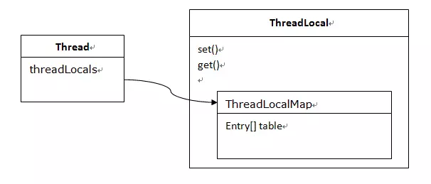

# ThreadLocal

## ThreadLocal是什么

ThreadLocal为变量在每个线程中都创建了一个副本，所以每个线程可以访问自己内部的副本变量，不同线程之间不会互相干扰，有点像HashMap，可以保存"key : value"键值对，但是一个ThreadLocal只能保存一个，并且各个线程的数据互不干扰，在多线程情况下保证自己线程数据不被修改。

## 应用场景

```
class Value {
  private static ThreadLocal<Value> value= new ThreadLocal<>();
  public static Value init() {
      value.set(new Value());
  }
  public static Value get() {
    value.get();
  }
}
```

- 在模块A中通过Value.init初始化。
- 在模块B或模块C中通过Value.get方法可以获得同一线程中模块A已经初始化的Value对象。

## ThreadLocal原理

从线程Thread的角度来看，每个线程内部都会持有一个对ThreadLocalMap实例的引用，ThreadLocalMap实例相当于线程的局部变量空间，存储着线程各自的数据，具体如下：



### Entry

Entry继承自WeakReference类，是存储线程私有变量的数据结构。ThreadLocal实例作为引用，意味着如果ThreadLocal实例为null，就可以从table中删除对应的Entry。

```
class Entry extends WeakReference<ThreadLocal<?>> {
    Object value;
    Entry(ThreadLocal<?> k, Object v) {
        super(k);
        value = v;
    }
}
```

### ThreadLocalMap

内部使用table数组存储Entry，默认大小INITIAL_CAPACITY(16)，先介绍几个参数：

- size：table中元素的数量。
- threshold：table大小的2/3，当size >= threshold时，遍历table并删除key为null的元素，如果删除后size >= threshold*3/4时，需要对table进行扩容。

#### ThreadLocal.set() 实现

```
public void set(T value) {
    Thread t = Thread.currentThread();
    ThreadLocalMap map = getMap(t);
    if (map != null)
        map.set(this, value);
    else
        createMap(t, value);
}

ThreadLocalMap getMap(Thread t) {
    return t.threadLocals;
}
```

从上面代码中看出来：

- 从当前线程Thread中获取ThreadLocalMap实例。
- ThreadLocal实例和value封装成Entry。

接下去看看Entry存入table数组如何实现的：

```
private void set(ThreadLocal<?> key, Object value) {
    Entry[] tab = table;
    int len = tab.length;
    int i = key.threadLocalHashCode & (len-1);

    for (Entry e = tab[i]; e != null; e = tab[i = nextIndex(i, len)]) {
        ThreadLocal<?> k = e.get();
        if (k == key) {
            e.value = value;
            return;
        }
        if (k == null) {
            replaceStaleEntry(key, value, i);
            return;
        }
    }

    tab[i] = new Entry(key, value);
    int sz = ++size;
    if (!cleanSomeSlots(i, sz) && sz >= threshold)
        rehash();
}
```

1. 通过ThreadLocal的nextHashCode方法生成hash值。
```
private static AtomicInteger nextHashCode = new AtomicInteger();
private static int nextHashCode() {    
    return nextHashCode.getAndAdd(HASH_INCREMENT);
}
```
从nextHashCode方法可以看出，ThreadLocal每实例化一次，其hash值就原子增加HASH_INCREMENT。

2. 通过 hash & (len -1) 定位到table的位置i，假设table中i位置的元素为f。
3. 如果f != null，假设f中的引用为k：
  - 如果k和当前ThreadLocal实例一致，则修改value值，返回。
  - 如果k为null，说明这个f已经是stale(陈旧的)的元素。调用replaceStaleEntry方法删除table中所有陈旧的元素（即entry的引用为null）并插入新元素，返回。
  - 否则通过nextIndex方法找到下一个元素f，继续进行步骤3。

4. 如果f == null，则把Entry加入到table的i位置中。
5. 通过cleanSomeSlots删除陈旧的元素，如果table中没有元素删除，需判断当前情况下是否要进行扩容

#### table扩容

如果table中的元素数量达到阈值threshold的3/4，会进行扩容操作，过程很简单：

```
private void resize() {
    Entry[] oldTab = table;
    int oldLen = oldTab.length;
    int newLen = oldLen * 2;
    Entry[] newTab = new Entry[newLen];
    int count = 0;

    for (int j = 0; j < oldLen; ++j) {
        Entry e = oldTab[j];
        if (e != null) {
            ThreadLocal<?> k = e.get();
            if (k == null) {
                e.value = null; // Help the GC
            } else {
                int h = k.threadLocalHashCode & (newLen - 1);
                while (newTab[h] != null)
                    h = nextIndex(h, newLen);
                newTab[h] = e;
                count++;
            }
        }
    }

    setThreshold(newLen);
    size = count;
    table = newTab;
}   
```

1. 新建新的数组newTab，大小为原来的2倍。
2. 复制table的元素到newTab，忽略陈旧的元素，假设table中的元素e需要复制到newTab的i位置，如果i位置存在元素，则找下一个空位置进行插入。

#### ThreadLocal.get() 实现

```
public T get() {
    Thread t = Thread.currentThread();
    ThreadLocalMap map = getMap(t);
    if (map != null) {
        ThreadLocalMap.Entry e = map.getEntry(this);
        if (e != null) {
            @SuppressWarnings("unchecked")
            T result = (T)e.value;
            return result;
        }
    }
    return setInitialValue();
}

private Entry getEntry(ThreadLocal<?> key) {
    int i = key.threadLocalHashCode & (table.length - 1);
    Entry e = table[i];
    if (e != null && e.get() == key)
        return e;
    else
        return getEntryAfterMiss(key, i, e);
}
```

获取当前的线程的threadLocals。

- 如果threadLocals不为null，则通过ThreadLocalMap.getEntry方法找到对应的entry，如果其引用和当前key一致，则直接返回，否则在table剩下的元素中继续匹配。
- 如果threadLocals为null，则通过setInitialValue方法初始化，并返回。

```
private Entry getEntryAfterMiss(ThreadLocal<?> key, int i, Entry e) {
    Entry[] tab = table;
    int len = tab.length;
    while (e != null) {
        ThreadLocal<?> k = e.get();
        if (k == key)
            return e;
        if (k == null)
            expungeStaleEntry(i);
        else
            i = nextIndex(i, len);
        e = tab[i];
    }
    return null;
}
```

## 内存泄漏

通过之前的分析已经知道，当使用ThreadLocal保存一个value时，会在ThreadLocalMap中的数组插入一个Entry对象，按理说key-value都应该以强引用保存在Entry对象中，但在ThreadLocalMap的实现中，key被保存到了WeakReference对象中。
这就导致了一个问题，ThreadLocal在没有外部强引用时，发生GC时会被回收，如果创建ThreadLocal的线程一直持续运行，那么这个Entry对象中的value就有可能一直得不到回收，发生内存泄露。

当一个线程调用ThreadLocal的set方法设置变量时候，当前线程的ThreadLocalMap里面就会存放一个记录，这个记录的key为ThreadLocal的引用，value则为设置的值。如果当前线程一直存在而没有调用ThreadLocal的remove方法，并且这时候其它地方还是有对ThreadLocal的引用，则当前线程的ThreadLocalMap变量里面会存在ThreadLocal变量的引用和value对象的引用是不会被释放的，这就会造成内存泄露的。但是考虑如果这个ThreadLocal变量没有了其他强依赖，而当前线程还存在的情况下，由于线程的ThreadLocalMap里面的key是弱依赖，则当前线程的ThreadLocalMap里面的ThreadLocal变量的弱引用会被在gc的时候回收，但是对应value还是会造成内存泄露，这时候ThreadLocalMap里面就会存在key为null但是value不为null的entry项。其实在ThreadLocal的set和get和remove方法里面有一些时机是会对这些key为null的entry进行清理的，但是这些清理不是必须发生的，下面简单说下ThreadLocalMap的remove方法的清理过程：

```
private void remove(ThreadLocal<?> key) {
    Entry[] tab = table;
    int len = tab.length;
    int i = key.threadLocalHashCode & (len-1);
    for (Entry e = tab[i];
         e != null;
         e = tab[i = nextIndex(i, len)]) {
        if (e.get() == key) {
            e.clear();
            expungeStaleEntry(i);
            return;
        }
    }
}
```

有一篇很详细的文章：[地址](https://www.jianshu.com/p/dde92ec37bd1)

**总结**：ThreadLocalMap内部Entry中key使用的是对ThreadLocal对象的**弱引用**，这为避免内存泄露是一个进步，因为如果是强引用，那么即使其他地方没有对ThreadLocal对象的引用，ThreadLocalMap中的ThreadLocal对象还是不会被回收，而如果是弱引用则这时候ThreadLocal引用是会被回收掉的，对于的value还是不能被回收，这时候ThreadLocalMap里面就会存在key为null但是value不为null的entry项，虽然ThreadLocalMap提供了set,get,remove方法在一些时机下会对这些Entry项进行清理，但是这是不及时的，也不是每次都会执行的，所以一些情况下还是会发生内存泄露，所以在使用完毕后即**调用remove方法**才是解决内存泄露的王道。

```
ThreadLocal<String> localName = new ThreadLocal();
try {
    localName.set("Gar");
    // 其它业务逻辑
} finally {
    localName.remove();
}
```

[参考](https://www.jianshu.com/p/33c5579ef44f)
[参考](https://www.jianshu.com/p/377bb840802f)
[参考](https://www.jianshu.com/p/d225dde8c23c)
