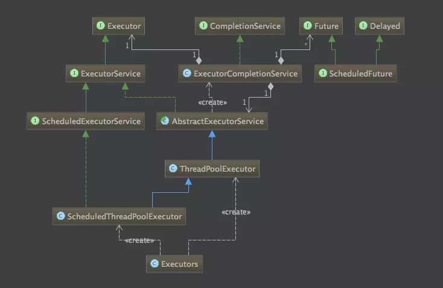

# 线程

Android 的线程池一共有

## ThreadPoolExecutor 基本线程池

### 什么时候使用线程池？

线程池主要是通过对多个任务重用线程，线程创建的开销被分摊到了多个任务上，减少为每个请求创建新线程和销毁线程上花费的时间和消耗的系统资源。

- 单个任务处理时间比较短
- 需要处理的任务数量很大

线程池类图，[图片来源](https://www.jianshu.com/p/d2729853c4da)



### 使用线程池的好处

引用自 [聊聊并发（三）Java线程池的分析和使用](http://ifeve.com/java-threadpool) 的说明：

- 降低资源消耗。通过重复利用已创建的线程降低线程创建和销毁造成的消耗。
- 提高响应速度。当任务到达时，任务可以不需要的等到线程创建就能立即执行。
- 提高线程的可管理性。线程是稀缺资源，如果无限制的创建，不仅会消耗系统资源，还会降低系统的稳定性，使用线程池可以进行统一的分配，调优和监控。

### Executor框架

Executor框架是一个根据一组执行策略调用，调度，执行和控制的异步任务的框架，目的是提供一种将”任务提交”与”任务如何运行”分离开来的机制。

- Executor：一个运行新任务最基础接口，另一个类叫Executors
```
    public interface Executor {
        void execute(Runnable command);
    }

    //使用
    Executor executor = anExecutor();
    executor.execute(new RunnableTask1());
    executor.execute(new RunnableTask2());
```

- ExecutorService：扩展了Executor接口，提供了管理终止的方法，以及可为跟踪一个或多个异步任务执行状况而生成 Future 的方法。增加了shutDown()，shutDownNow()，invokeAll()，invokeAny()和submit()等方法。如果需要支持即时关闭，也就是shutDownNow()方法，则任务需要正确处理中断。

ExecutorService 的submit() 与execute()区别
（1）接受的参数不一样。 submit可以接收runable和callable ； execute接收runnable
（2）submit有返回值，runnable没有返回值（假设我们有很多个做validation的task，我想等到所有的task执行完，然后每个task都告诉我执行结果是成功还是失败）
（3）submit方便Exception处理（针对的情况就是假设你的task会抛出checked或者unCheck的异常，你希望外面的调用者能够知晓这些异常并做出处理，那么就需要使用到submit捕获Future.get抛出的异常）

- ScheduledExecutorService：扩展ExecutorService，支持延时和定期执行任务。

下面看ExecutorService的实现类ThreadPoolExecutor

```
    public ThreadPoolExecutor(int corePoolSize,
                              int maximumPoolSize,
                              long keepAliveTime,
                              TimeUnit unit,
                              BlockingQueue<Runnable> workQueue,
                              ThreadFactory threadFactory,
                              RejectedExecutionHandler handler) {
        if (corePoolSize < 0 ||
            maximumPoolSize <= 0 ||
            maximumPoolSize < corePoolSize ||
            keepAliveTime < 0)
            throw new IllegalArgumentException();
        if (workQueue == null || threadFactory == null || handler == null)
            throw new NullPointerException();
        this.corePoolSize = corePoolSize;
        this.maximumPoolSize = maximumPoolSize;
        this.workQueue = workQueue;
        this.keepAliveTime = unit.toNanos(keepAliveTime);
        this.threadFactory = threadFactory;
        this.handler = handler;
    }
```

corePoolSize：核心线程数量，当有新任务在execute()方法提交时，会执行以下判断：

- 如果运行的线程少于 corePoolSize，则创建新线程来处理任务，即使线程池中的其他线程是空闲的；
- 如果线程池中的线程数量大于等于 corePoolSize 且小于 maximumPoolSize，则只有当workQueue满时才创建新的线程去处理任务；
- 如果设置的corePoolSize 和 maximumPoolSize相同，则创建的线程池的大小是固定的，这时如果有新任务提交，若workQueue未满，则将请求放入workQueue中，等待有空闲的线程去从workQueue中取任务并处理；
- 如果运行的线程数量大于等于maximumPoolSize，这时如果workQueue已经满了，则通过handler所指定的策略来处理任务；

所以，任务提交时，判断的顺序为 corePoolSize --> workQueue --> maximumPoolSize。

maximumPoolSize：最大线程数量；
workQueue：等待队列，当任务提交时，如果线程池中的线程数量大于等于corePoolSize的时候，把该任务封装成一个Worker对象放入等待队列；

workQueue：保存等待执行的任务的阻塞队列，当提交一个新的任务到线程池以后, 线程池会根据当前线程池中正在运行着的线程的数量来决定对该任务的处理方式，主要有以下几种处理方式:

- 直接切换：这种方式常用的队列是SynchronousQueue，但现在还没有研究过该队列，这里暂时还没法介绍；

- 使用无界队列：一般使用基于链表的阻塞队列LinkedBlockingQueue。如果使用这种方式，那么线程池中能够创建的最大线程数就是corePoolSize，而maximumPoolSize就不会起作用了（后面也会说到）。当线程池中所有的核心线程都是RUNNING状态时，这时一个新的任务提交就会放入等待队列中。

- 使用有界队列：一般使用ArrayBlockingQueue。使用该方式可以将线程池的最大线程数量限制为maximumPoolSize，这样能够降低资源的消耗，但同时这种方式也使得线程池对线程的调度变得更困难，因为线程池和队列的容量都是有限的值，所以要想使线程池处理任务的吞吐率达到一个相对合理的范围，又想使线程调度相对简单，并且还要尽可能的降低线程池对资源的消耗，就需要合理的设置这两个数量。


如果要想降低系统资源的消耗（包括CPU的使用率，操作系统资源的消耗，上下文环境切换的开销等）, 可以设置较大的队列容量和较小的线程池容量, 但这样也会降低线程处理任务的吞吐量。
如果提交的任务经常发生阻塞，那么可以考虑通过调用 setMaximumPoolSize() 方法来重新设定线程池的容量。
如果队列的容量设置的较小，通常需要将线程池的容量设置大一点，这样CPU的使用率会相对的高一些。但如果线程池的容量设置的过大，则在提交的任务数量太多的情况下，并发量会增加，那么线程之间的调度就是一个要考虑的问题，因为这样反而有可能降低处理任务的吞吐量。


keepAliveTime：线程池维护线程所允许的空闲时间。当线程池中的线程数量大于corePoolSize的时候，如果这时没有新的任务提交，核心线程外的线程不会立即销毁，而是会等待，直到等待的时间超过了keepAliveTime；
threadFactory：它是ThreadFactory类型的变量，用来创建新线程。默认使用Executors.defaultThreadFactory() 来创建线程。使用默认的ThreadFactory来创建线程时，会使新创建的线程具有相同的NORM_PRIORITY优先级并且是非守护线程，同时也设置了线程的名称。

handler：它是RejectedExecutionHandler类型的变量，表示线程池的饱和策略。如果阻塞队列满了并且没有空闲的线程，这时如果继续提交任务，就需要采取一种策略处理该任务。线程池提供了4种策略：

AbortPolicy：直接抛出异常，这是默认策略；
CallerRunsPolicy：用调用者所在的线程来执行任务；
DiscardOldestPolicy：丢弃阻塞队列中靠最前的任务，并执行当前任务；
DiscardPolicy：直接丢弃任务；
